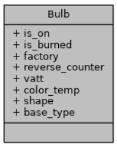
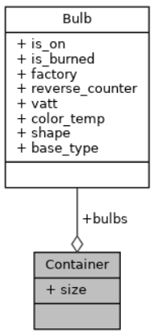

# Лабораторна робота №15. Динамічні масиви

## 1. Вимоги

### 1.1 Розробник

* Хелемендик Дмитро Олегович;
* студент групи КН-921д;
* 01-трав-2022.

### 1.2 Загальне завдання

На базі попередньо розробленого функціоналу по роботі з прикладною областю сформувати
динамічний масив елементів розробленої структури. Реалізувати наступні функції роботи зі
списком:
• вивід вмісту списку на екран;
• реалізувати функцію №1 з категорії “Методи для роботи з колекцією” (див. завдання з РЗ);
• додавання об’єкта у кінець списку;
• видалення об’єкта зі списку за індексом.
• сортування вмісту списку за одним з критеріїв
Зверніть увагу. Проект має складатися з 6 файлів (main.c, test.c, list.h, list.c, entity.c, entity.h).

## 2. Опис програми

### 2.1 Функціональне призначення

Програма призначена для додавання, видалення лампочок, знаходження згорівших лампочок та сортування за заданим критерієм. Програма працює за допомогою функцій, що задекларовані в *entity.h*, *list.h*, *stdlib.h*, *string.h* та *stdio.h*.

Результат зберігається у змінній *container*.

Демонстрація знайдених результатів передбачає виконання програми у вікні консолі.

### 2.2 Опис логічної структури

За допомогою ключового слова *struct* описуємо лампочку, що має 8 полів – чи ввімкнена лампочка, чи перегоріла лампочка, виробник, зворотній лічильник, ватти, температура колбору світіння, форма, тип цоколю. Розроблено структуру, вміст якої подано нижче.



Також описуємо структуру контейнера, що має два поля - лампочки та їх кількість.



Опис розроблених структур і функцій наводиться на базі результатів роботи системи автодокументування *Doxygen*.

#### Функція заповнення структури

```
	void get_bulb(struct Bulb *e);
```

*Призначення*: отримання лампочки.

*Опис роботи*: функція запитує у користувача дані та записує їх у структуру.

**Аргументи**:

- *е* - показник на структуру "лампочка".

#### Функція отримання позиції для додавання елемента у контейнер

```
	size_t get_position_to_add(size_t size);
```

*Призначення*: отримання позиції для подальшого розташування лампочки.

*Опис роботи*: функція запитує у користувача в яку позицію записати елемент у контейнер, якщо він не нульовий.

**Аргументи**:

- *size* - кількість лампочок.

#### Функція отримання позиції для видалення елемента з контейнера

```
	size_t get_position_to_remove(size_t size);
```

*Призначення*: отримання позиції для видалення лампочки.

*Опис роботи*: функція запитує у користувача в який елемент видалити у контейнері.

**Аргументи**:

- *size* - кількість лампочок.

#### Функція додавання лампочки у контейнер

```
	void insert_bulb(struct Container *container, size_t pos, struct Bulb *bulb);
```

*Призначення*: додавання лампочки у контейнер.

*Опис роботи*: функція виділяє пам'ять для більшого масива, переписує в нього старі лампочки(якщо вони є) та додає нову лампочку.

**Аргументи**:

- *container* - показчик на контейнер з лампочками;
- *pos* - позиція для додавання;
- *bulb* - лампочка, яку потрібно додати.

#### Функція видалення лампочки з контейнера

```
	void remove_bulb(struct Container *container, size_t pos);
```

*Призначення*: видалення лампочки з контейнера.

*Опис роботи*: функція виділяє пам'ять для меншого масива, переписує в нього старі лампочки без той, що потрібно видалити.

**Аргументи**:

- *container* - показчик на контейнер з лампочками;
- *pos* - позиція для додавання.

#### Функція взаємодії з користувачем

```
	int get_answer();
```

*Призначення*: взаємодія з користувачем.

*Опис роботи*: функція запитує у користувача який саме функціонал він хоче виконати. Повертає номер функції.

#### Функція, що перевіряє чи згорівша лампочка

```
	int is_burned_bulb(struct Container *container);
```

*Призначення*: перевірити, чи є згорівша лампочка.

*Опис роботи*: функція перевіряє чи згоріла хоча б одна одна лампочка. Повертає 1, якщо хоча б одна лампочка згоріла.

**Аргументи**:

- *container* - показчик на контейнер.

#### Функція, що друкує згорівші лампочки

```
	void print_burned_bulbs(struct Container *cont);
```

*Призначення*: друк згорівших лампочок.

*Опис роботи*: функція перевіряє чи є згорівші лампочки та якщо вони є - друкує їх.

**Аргументи**:

- *container* - показчик на контейнер.

#### Функція для знаходження згорівших лампочок

```
	void find_burned_bulbs(struct Container *container);
```

*Призначення*: знаходження згорівших лампочок.

*Опис роботи*: функція перевіряє чи є лампочки взагалі, якщо є - перевіряє на наявність згорівшої лампочки функцією is_burned_bulb, та при наявності хоча б однієї згорівшої лампочки - друкує її за допомогою функції print_burned_bulbs.

**Аргументи**:

- *container* - показчик на контейнер.

#### Функція сортування лампочок за критерієм

```
	void sort_by_criterion(struct Container *cont);
```

*Призначення*: відсортувати лампочки за критерієм.

*Опис роботи*: функція запитує критерій для сортування та друкує відсортованні лампочки.

**Аргументи**:

- *container* - показчик на контейнер.

#### Функція для друку лампочок

```
	void print_bulbs(struct Container *cont);
```

*Призначення*: надрукувати наявні лампочки.

*Опис роботи*: функція друкує лампочки, якщо вони є.

**Аргументи**:

- *cont* - показчик на структуру контейнер.

#### Основна функція

```
	int main() 
```

*Призначення*: головна функція.

*Опис роботи*: 

 - виділяю пам'ять для динамічного масива та однієї лампочки;
 - далі у користувача запитую, яку функцію він хоче виконати за допомогою функції get_anwer;
 - якщо користувач захоче виконати додавання лампочки до масиву, то, при наявності лампочок, буде запитано на яку позицію він хоче помістити лампочку функцією get_position_to_add, далі будуть зчитані дані шляхом виклику функції get_bulb, та додавання лампочки у масив за допомогою функції insert_bulb;
 - при видаленні лампочки буде запитання позиція для видаллення функцією get_position_to_remove та видалення самої лампочки за допомогою remove_bulb;
 - при знаходження згорілої лампочки від користувача нічого не потрібно, функція find_burned_bulbs знаходе перегорівші лампочки, якщо вони є;
 - при сортуванні лампочок за критерієм функція sort_by_criterion запитує у користувача критерій та друкує відсортовані лампочки;
 - шлязом виклику функції print_bulbs користувач друкує всі наявні лапочки;
 - звільнюю пам'ять;
 - успішний код повернення з програми (0).

### Структура проекту:

```
     └── lab15
	├── doc
	│   ├── assets
	│   │   └── bulb_fields.png
	│   │   └── container_fields.png
	│   ├── lab15.docx
	│   └── lab15.md
	│   └── lab15.pdf
	├── Doxyfile
	├── Makefile
	├── README.md
	├── src
	│   ├── list.c
	│   ├── list.h
	│   ├── entity.c
	│   ├── entity.h
	│   └── main.c
	└── test
	    └── test.c

```

### 2.3 Важливі фрагменти програми

#### Додавання лампочки до контейнера

```
	struct Bulb *new_bulbs = malloc((container->size + 1) * sizeof(struct Bulb));
	if (pos > container->size)
		pos = container->size;
	memcpy(new_bulbs, container->bulbs, pos * sizeof(struct Bulb));
	memcpy(new_bulbs + pos, bulb, sizeof(struct Bulb));
	memcpy(new_bulbs + pos + 1, container->bulbs + pos, (container->size - pos) * sizeof(struct Bulb));
	free(container->bulbs);
	container->bulbs = new_bulbs;
	container->size++;
	printf("Successfully!\n");
```

#### Видалення лампочки з контейнера

```
	if (container->size == 0)
		return;
	struct Bulb *new_bulbs = malloc((container->size - 1) * sizeof(struct Bulb));
	if (pos >= container->size)
		pos = container->size - 1;
	memcpy(new_bulbs, container->bulbs, pos * sizeof(struct Bulb));
	memcpy(new_bulbs + pos, container->bulbs + pos + 1, (container->size - pos - 1) * sizeof(struct Bulb));
	free(container->bulbs);
	container->bulbs = new_bulbs;
	container->size--;
	printf("Successfully!\n");
```

#### Запис до структури

```
	char *p = strtok(string, delim);
	if (!p || !strncpy(bulbs->is_on, p, sizeof(bulbs->is_on) - 1))
		return 1;
	if (!(p = strtok(NULL, delim)) || !strncpy(bulbs->is_burned, p, sizeof(bulbs->is_burned) - 1))
		return 1;
	if (!(p = strtok(NULL, delim)) || !strncpy(bulbs->factory, p, sizeof(bulbs->factory) - 1))
		return 1;
	if (!(p = strtok(NULL, delim)) || sscanf(p, "%d", &(bulbs->reverse_counter)) != 1)
		return 1;
	if (!(p = strtok(NULL, delim)) || sscanf(p, "%d", &(bulbs->vatt)) != 1)
		return 1;
	if (!(p = strtok(NULL, delim)) || sscanf(p, "%d", &(bulbs->color_temp)) != 1)
		return 1;
	if (!(p = strtok(NULL, delim)) || !strncpy(bulbs->shape, p, sizeof(bulbs->shape) - 1))
		return 1;
	if (!(p = strtok(NULL, delim)) || !strncpy(bulbs->base_type, p, sizeof(bulbs->base_type) - 1))
		return 1;

	return 0;
```

## 3. Варіанти використання

Для демонстрації результатів кожної задачі використовується:

- виконання програми у вікні консолі.

**Варіант використання 1**: запуск програми у вікні консолі:

- запустити програму у консолі;
- далі потрібно взаємодіяти з меню програми;
- подивитись результат програми.

```
	dima@dima-VirtualBox:~/dev/programing-khelemendyk/lab15/dist$ ./main.bin 

	What you want to do?
	0 - exit;
	1 - add bulb;
	2 - remove bulb;
	3 - find burnt out bulbs;
	4 - sort bulbs for criterion;
	5 - print bulbs;
	Answer: 1

	Is bulb on?(yes/no): yes
	Is bulb burned out?(yes/no): no
	Who is bulb manufacturer?: TOV Roga ta koputa
	How many bulbs are left before it burns out?: 20
	What is the number of vatt?: 15
	What is the color temperature?: 1800
	What is the shape of bulb?: GLobe
	What is the base type of bulb?: E40
	Successfully!

	What you want to do?
	0 - exit;
	1 - add bulb;
	2 - remove bulb;
	3 - find burnt out bulbs;
	4 - sort bulbs for criterion;
	5 - print bulbs;
	Answer: 1 

	In what position do you want to add bulb?(From 1 to 2)
	Position: 2
	Is bulb on?(yes/no): no 
	Is bulb burned out?(yes/no): yes
	Who is bulb manufacturer?: TOV Romashka
	How many bulbs are left before it burns out?: 40
	What is the number of vatt?: 30
	What is the color temperature?: 3600
	What is the shape of bulb?: Circle            
	What is the base type of bulb?: E20
	Successfully!

	What you want to do?
	0 - exit;
	1 - add bulb;
	2 - remove bulb;
	3 - find burnt out bulbs;
	4 - sort bulbs for criterion;
	5 - print bulbs;
	Answer: 1

	In what position do you want to add bulb?(From 1 to 3)
	Position: 2 
	Is bulb on?(yes/no): yes
	Is bulb burned out?(yes/no): yes
	Who is bulb manufacturer?: TOV Kapysta
	How many bulbs are left before it burns out?: 19
	What is the number of vatt?: 10
	What is the color temperature?: 1400
	What is the shape of bulb?: Ogive
	What is the base type of bulb?: S27
	Successfully!

	What you want to do?
	0 - exit;
	1 - add bulb;
	2 - remove bulb;
	3 - find burnt out bulbs;
	4 - sort bulbs for criterion;
	5 - print bulbs;
	Answer: 3

	Burnt out bulb(s):
	Bulb 2: yes, yes, TOV Kapysta, 19, 10, 1400, Ogive, S27
	Bulb 3: no, yes, TOV Romashka, 40, 30, 3600, Circle, E20

	What you want to do?
	0 - exit;
	1 - add bulb;
	2 - remove bulb;
	3 - find burnt out bulbs;
	4 - sort bulbs for criterion;
	5 - print bulbs;
	Answer: 4

	Choose the criterion:
	1. Bulb is on
	2. Bulb is burnt out
	3. Bulb manufacturer
	4. Reverse counter
	5. Number of watts
	6. Color temperature
	7. Shape
	8. Base type
	Number: 3
	Your criterion for sorting: 3. Bulb manufacturer
	Bulb 1: TOV Roga ta koputa
	Bulb 2: TOV Kapysta
	Bulb 3: TOV Romashka

	What you want to do?
	0 - exit;
	1 - add bulb;
	2 - remove bulb;
	3 - find burnt out bulbs;
	4 - sort bulbs for criterion;
	5 - print bulbs;
	Answer: 5

	Your bulbs:
	Bulb 1: yes, no, TOV Roga ta koputa, 20, 15, 1800, GLobe, E40
	Bulb 2: yes, yes, TOV Kapysta, 19, 10, 1400, Ogive, S27
	Bulb 3: no, yes, TOV Romashka, 40, 30, 3600, Circle, E20

	What you want to do?
	0 - exit;
	1 - add bulb;
	2 - remove bulb;
	3 - find burnt out bulbs;
	4 - sort bulbs for criterion;
	5 - print bulbs;
	Answer: 2

	What bulb do you want to remove?(From 1 to 3)
	Bulb number: 1
	Successfully!

	What you want to do?
	0 - exit;
	1 - add bulb;
	2 - remove bulb;
	3 - find burnt out bulbs;
	4 - sort bulbs for criterion;
	5 - print bulbs;
	Answer: 5

	Your bulbs:
	Bulb 1: yes, yes, TOV Kapysta, 19, 10, 1400, Ogive, S27
	Bulb 2: no, yes, TOV Romashka, 40, 30, 3600, Circle, E20

	What you want to do?
	0 - exit;
	1 - add bulb;
	2 - remove bulb;
	3 - find burnt out bulbs;
	4 - sort bulbs for criterion;
	5 - print bulbs;
	Answer: 0

	Have a nice day!

```

## Висновки

При виконанні даної лабораторної роботи було набуто практичного досвіду у взаємодії з динамічними масивами.
